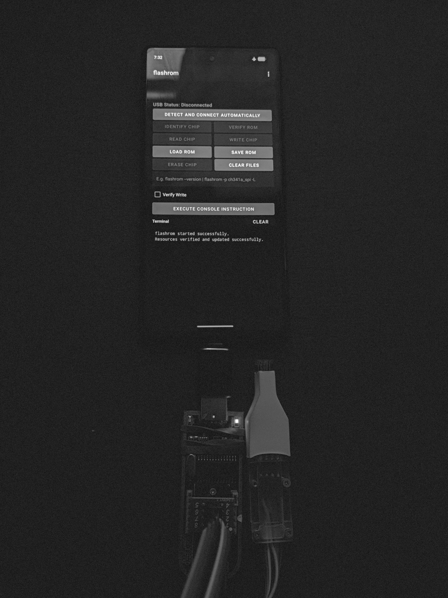

# flashrom for Android

Read, verify, erase and write SPI flash chips from an Android phone, using a real
CH341A or similar USB programmer plugged in over OTG.


The usual way to recover a laptop with a dead BIOS is to sit a second working
laptop next to it, plug the programmer into that, and run flashrom. This does the
same job with a phone instead, It runs the genuine flashrom binary compiled for arm64, not a
reimplementation, so chip detection and the erase and write logic behave the way
they do on a desktop.

This is a fork of [Flash SPI Tool](https://github.com/Danielk10/Flash-EEPROM-Tool)
by Danielk10, who did the hard part: working out how to hand Android's USB file
descriptor to libusb so flashrom can talk to a programmer without root. See
[Differences from upstream](#differences-from-upstream) for what changed here and
why.

## What it does

The main screen gives you identify, read, verify, write and erase, plus a box for
typing flashrom commands directly when you want something the buttons do not
cover. There is a hex viewer and a hex compare tool for checking dumps against
each other, which is worth doing before you trust any image you are about to
write.

There is also a SHA-256 screen, which exists for one job: telling you whether a
dump is trustworthy. Read the chip a few times, export each read with SAVE ROM
under a different name, then add them all here. If the hashes agree the reads are
stable. If they do not, something is wrong with the wiring, the clip contact, or
the board is fighting you because the chip is still in circuit, and you should fix
that before writing anything. It hashes by streaming, so dump size does not matter,
and the hashes are plain lowercase hex that you can check against `sha256sum` on a
desktop.

Sixteen programmers are compiled in. The ones most people will care about are
ch341a_spi, ch347_spi, ft2232_spi, dediprog, stlinkv3_spi and jlink_spi. Serial
programmers work too, including serprog on an Arduino, Bus Pirate and SPIDriver,
which the app drives through a pseudo terminal bridged to the USB serial port.
There is also flashrom's dummy programmer for testing the app without any
hardware attached.

## What you need

An Android 6.0 or newer phone with USB host support, a USB OTG adapter, and a
supported programmer. Almost everyone reading this will have a CH341A, and almost
everyone's CH341A is the black board that needs the pin 28 modification, because
as shipped it drives the SPI lines at 5V while the chip runs at 3.3V. Fix that
before you connect it to anything you care about. The blue boards are wired
correctly and only need the jumper set.

Only arm64 is built. There is no 32 bit or x86 variant.

## Building

You need JDK 17 or newer, the Android SDK with platform 37 and build tools 37.0.0,
NDK 30.0.16248370 and CMake 4.1.2. Point `local.properties` at your SDK, then:

```
./gradlew assembleDebug
```

For a signed release, create `keystore.properties` in the project root with
`storeFile`, `storePassword`, `keyAlias` and `keyPassword`, then run
`./gradlew assembleRelease`. Note that `app/build.gradle` redirects the build
directory to `/tmp/flashrom`, so that is where the APK lands rather than
`app/build`.

### Rebuilding the native libraries

The prebuilt `.so` files in `app/src/main/jniLibs/arm64-v8a/` can be regenerated
from source. `native/build-libusb.sh` does libusb, including applying the Android
file descriptor patch from `native/patches/`, and verifies the result has the
right soname, 16KB page alignment and the patch actually present. The meson cross
file for flashrom is `native/android-arm64.ini`.

Upstream versions currently in use are libusb 1.0.30, libftdi 1.5, libjaylink
0.5.0, libconfuse 3.3 and flashrom 1.8.0, all cross compiled against API 23 with
`-fstack-protector-strong`, `-D_FORTIFY_SOURCE=2`, full RELRO and 16KB page
alignment for Android 15 and later.

## Differences from upstream

Every native library was rebuilt from pinned upstream source rather than shipped
as an inherited binary. The libusb Android patch was converted from a Python
script that did fuzzy text matching into a real patch file applied with
`git apply`, so if upstream moves the build stops instead of quietly producing a
libusb with no Android support.

All network access is gone. The advertising, the Microsoft AppCenter analytics and
crash reporting, and the Play Billing integration were removed, along with the
`INTERNET` permission itself. A tool that reads and writes firmware images has no
business talking to anything, and crash reports from a process holding a BIOS dump
are a poor idea. `allowBackup` is off for the same reason.

The PCI and internal programmers were dropped. They need root or raw PCI access
and cannot work in an unprivileged Android app, so they were only ever dead weight,
and removing them took libpci, lspci, setpci, OpenSSL and zlib out of the APK with
them.

Two bugs were fixed along the way. Content was drawing underneath the status bar
and action bar because nothing applied window insets, which Android 15 and later
require once you target SDK 35. And when flashrom reported more than one matching
chip definition, the chip picker never appeared: the parser only collected chip
names after seeing the "Multiple flash chip definitions match" line, but flashrom
prints the candidates before it, and the dialog set both a message and a list,
which `AlertController` silently resolves by dropping the list.

The USB device filter was trimmed to actual programmers, so Android no longer
offers to launch this app every time any USB serial adapter is plugged in.

## Known issues

After a read or a write, a second probe will often fail until the app is closed
and the programmer reattached. The app holds one `UsbDeviceConnection` open for its
whole lifetime and each flashrom process gets a duplicate of that file descriptor,
so the programmer is never re-enumerated between runs.

Read and load share one file. `READ CHIP` writes to `bios.bin` in the app's private
storage and `LOAD ROM` writes the file you pick to that same path, so importing an
image will overwrite a dump you have not exported yet. Use `SAVE ROM` to get a read
out to real storage before loading anything.

Flashrom needs a chip definition when several match, which is common on Winbond
parts. The picker handles this, but it asks again on every operation because the
buttons pass fixed arguments with no `-c`.

<p align="center">
  
</p>

## Licence and credits

GPLv3, inherited from the upstream project.

The original app is [Flash SPI Tool](https://github.com/Danielk10/Flash-EEPROM-Tool)
by Danielk10. The libusb file descriptor approach that makes any of this possible
is his work.

Bundled projects and their licences: [flashrom](https://github.com/flashrom/flashrom)
(GPL-2.0), [libusb](https://github.com/libusb/libusb) (LGPL-2.1+),
[libftdi](https://developer.intra2net.com/git/libftdi) (LGPL-2.1+),
[libjaylink](https://gitlab.zapb.de/libjaylink/libjaylink) (GPL-2.0+),
[libconfuse](https://github.com/libconfuse/libconfuse) (ISC), and
[usb-serial-for-android](https://github.com/mik3y/usb-serial-for-android) (MIT).
